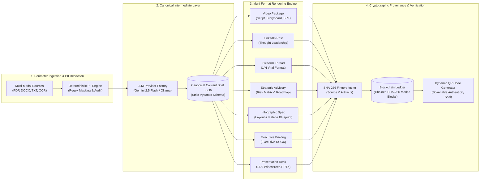

# TransmuteAI: System Architecture & Technical Specification

> **Document Class:** Technical Architecture Document (Max 2 Pages)  
> **Platform Version:** 1.0.0 Production  
> **Security Clearance:** Public / Open Architectural Specification  

---

## 1. Executive Summary & Design Philosophy

**TransmuteAI** is a modular, high-throughput Generative AI platform designed to eliminate **cross-format semantic drift** and **data privacy leakage** in enterprise document transformation workflows. 

Traditional GenAI systems prompt models independently for different channels (e.g. asking an LLM for a slide deck, then separately asking for an executive briefing or video script). This introduces **divergent statistics, inconsistent recommendations, and hallucinations**. TransmuteAI solves this by enforcing a two-phase architecture:
1. **Canonical Synthesis**: Ingesting multi-modal raw content, applying deterministic PII redaction, and synthesizing a single, strictly-typed **Content Brief JSON** intermediate representation.
2. **Parallel Deterministic Rendering**: Simultaneously compiling that single JSON brief into **7 distinct, human-grade deliverable formats** with SHA-256 cryptographic provenance anchored to an immutable blockchain ledger.

---

## 2. End-to-End Architectural Topology

---

## 3. Subsystem Breakdown & Key Invariants

### A. Zero-Trust PII Redaction Gateway
- **Mechanism**: Fast, deterministic regex masking executed at the memory perimeter before LLM dispatch.
- **Redaction Targets**: Emails (`[EMAIL_REDACTED]`), International Phones (`[PHONE_REDACTED]`), Social Security Numbers (`[SSN_REDACTED]`), Credit Cards (`[CREDIT_CARD_REDACTED]`), and IP Addresses (`[IP_REDACTED]`).
- **Audit Logging**: Generates masked original values (e.g., `jo***@domain.com`) for non-repudiation and compliance auditing without persisting sensitive customer data.

### B. Canonical Content Brief JSON intermediate
Rather than generating deliverables directly from unstructured text, the engine produces a normalized Pydantic model (`ContentBriefJSON`):
- `executive_summary`: High-impact headline, context, key findings, strategic recommendations.
- `video_package`: Creative concept, target run-time, scene-by-scene storyboard (camera angle, visual action, voiceover narration, audio cues, b-roll footage), and SubRip (`.srt`) subtitles.
- `linkedin_post`: Curiosity hook, white-space body, bullet insights, engagement CTA, and hashtags.
- `social_media_thread`: Numbered tweet sequence (1/N) optimized for viral social distribution.
- `advisory_document`: Executive mandate, strategic context, quantitative risk matrix (severity, likelihood, mitigation), phased roadmap (0-30, 30-60, 60-90 days), and governance directives.
- `infographic`: Narrative progression, color palette swatches, hero stat callouts, and quadrant layout directives.
- `presentation_outline`: Slide hierarchy (16:9) with bullet cards and speaker notes.

### C. Cryptographic Blockchain Provenance Ledger
- **Fingerprinting**: Every generated file and the input summary are hashed using SHA-256.
- **Block Chaining**: Each block contains `Index`, `Timestamp`, `BriefID`, `SourceHash`, `ArtifactHashes`, `PreviousHash`, `Nonce`, and `BlockHash`.
- **Tamper Evident**: Modifying a single character in any generated deliverable or prior block breaks the cryptographic chain (`chain_valid=False`).
- **Embedded QR Verification**: Every document and slide deck embeds a QR code resolving to `/api/provenance/verify`, enabling instant validation on any mobile device.

---

## 4. Scalability, Deployment & Infrastructure

| Tier | Component | Technology | Free Tier Deployment |
| :--- | :--- | :--- | :--- |
| **Frontend** | Responsive Dashboard | Next.js 14 (App Router), Tailwind CSS, Lucide | **Vercel** (Hobby Tier - $0/mo) |
| **API Gateway** | REST API & Task Manager | FastAPI, SlowAPI Rate Limiting, Pydantic v2 | **Render.com / Koyeb** ($0/mo) |
| **Execution** | Dual Engine (Celery / Direct) | Celery + Redis (Prod) / BackgroundTasks (Free) | In-process background tasks |
| **Inference** | LLM Engine | Google Gemini (`gemini-2.5-flash`), Ollama | **Google AI Studio Free Tier** |
| **Storage** | Relational & Ledger DB | PostgreSQL (Prod) / SQLite (Dev) | **Neon.tech** ($0/mo) / Local |

---

## 5. Security & Invariant Guarantees

1. **Deterministic Privacy Perimeter**: Unredacted sensitive data never crosses the network boundary to LLM inference providers.
2. **100% Semantic Parity**: Downstream renderers ingest identical JSON brief fields, ensuring facts across DOCX, PPTX, Video, and LinkedIn remain perfectly synchronized.
3. **Immutable Verification**: Cryptographic SHA-256 ledger guarantees tamper-proof non-repudiation for enterprise legal and regulatory compliance.
