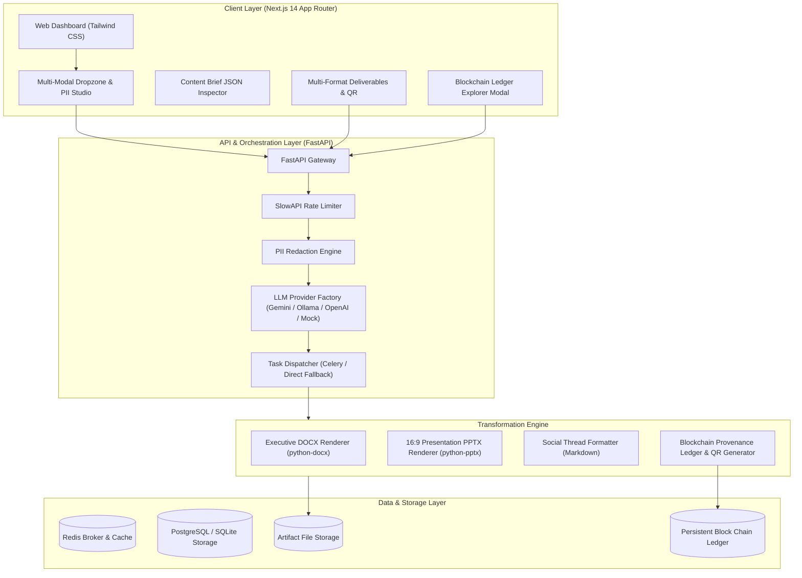

# TransmuteAI: Gen AI Platform for Automated Content Transformation

[](LICENSE)
[](https://fastapi.tiangolo.com)
[](https://nextjs.org)
[](https://aistudio.google.com)
[]()

**TransmuteAI** is a modular, scalable Generative AI platform engineered to ingest multi-modal source documents (PDF, DOCX, Plain Text, and Images via OCR), apply automated and deterministic PII redaction, synthesize the content into a strictly-validated **Content Brief JSON** intermediate representation, and asynchronously generate 7 synchronized, human-grade multi-format deliverables (**Video Package**, **LinkedIn Post**, **Twitter/X Thread**, **Strategic Advisory Memo**, **Infographic Blueprint**, **Executive Briefing**, and **Presentation Deck**) with cryptographic SHA-256 provenance anchored to a blockchain ledger and verified via embedded QR codes.

---

## 🏆 Evaluation Deliverables Index

| Deliverable | Description | Location / Link |
| :--- | :--- | :--- |
| **1. Source Code Repository** | Full production repository (Backend, Frontend, Workers, Tests) | Current Workspace / [GitHub Link](https://github.com/wraithhitek/TransMuteAI) |
| **2. Setup Instructions** | Step-by-step local development & Docker instructions | See [Local Setup Guide](#-local-development-setup) below |
| **3. Architecture Document** | Max 2-page formal technical specification with topology & guarantees | [`ARCHITECTURE.md`](file:///c:/Users/user/Desktop/TransMuteAI/ARCHITECTURE.md) |
| **4. Demo Video Script** | Max 2-minute timed script and screen recording walkthrough | [`DEMO_GUIDE.md`](file:///c:/Users/user/Desktop/TransMuteAI/DEMO_GUIDE.md) |
| **5. Technical Presentation** | Max 5-slide executive presentation slide deck | [`transmuteai_technical_presentation.pptx`](file:///c:/Users/user/Desktop/TransMuteAI/transmuteai_technical_presentation.pptx) |

---

## 🏛️ System Architecture



---

## 🚀 Key Features

1. **Multi-Modal Ingestion & PII Redaction**:
   - Ingests PDF (`pypdf`), DOCX (`python-docx`), plain text, and Images (with OCR contrast preprocessing).
   - High-speed deterministic regex redaction masking Emails (`[EMAIL_REDACTED]`), Phone numbers, SSNs, Credit Cards, and IP addresses with detailed audit logging.
2. **Canonical Content Brief JSON**:
   - Converts unstructured text into a strict Pydantic JSON schema (`brief_id`, `headline`, `key_findings`, `strategic_recommendations`, `presentation_outline`, `social_media_thread`).
   - Guarantees **100% semantic parity** across deliverables—eliminating cross-format hallucinations.
3. **Pluggable LLM Provider Factory**:
   - **Google Gemini (Default)**: Leverages the free tier (`gemini-2.5-flash` or `gemini-1.5-flash`) via Google AI Studio with native structured JSON output.
   - **Ollama Air-Gapped Mode**: Runs fully offline with local models (`llama3`, `mistral`, `phi3`).
   - **OpenAI**: Cloud fallback via `gpt-4o-mini`.
   - **Heuristic Mock Provider**: Offline test engine enabling zero-key testing and instant CI verification.
4. **Parallel Multi-Format Rendering**:
   - **Executive DOCX**: Custom styled Word document with structured metadata tables, accent callouts, and embedded QR code.
   - **Presentation PPTX**: Modern 16:9 slide deck with styled bullet cards and automated speaker notes.
   - **Social Media Thread**: Formatted multi-post thread with hooks, key takeaways, and hashtags.
5. **Cryptographic Blockchain Provenance & QR Code**:
   - Computes SHA-256 fingerprints of source text and generated artifacts.
   - Appends tamper-evident chained blocks (`Index`, `Timestamp`, `SourceHash`, `ArtifactHashes`, `PrevHash`, `Nonce`, `BlockHash`).
   - Generates scannable QR codes embedding verification URLs.
6. **Dual Execution Engine**:
   - **Celery Worker Mode**: Distributed task queue backed by Redis for high-throughput enterprise scale.
   - **Direct Background Mode**: Serverless/single-instance mode using FastAPI `BackgroundTasks` for 100% free hosting without external worker daemons.

---

## 🛠️ Tech Stack

- **Frontend**: Next.js 14 (App Router), React 18, Tailwind CSS, Lucide Icons, TypeScript
- **Backend**: Python 3.12, FastAPI, Pydantic v2, SlowAPI (rate limiting), SQLAlchemy, Celery, Redis
- **Document Processing**: `python-docx`, `python-pptx`, `pypdf`, `Pillow`, `pytesseract`, `qrcode`
- **Inference**: Google Gemini SDK (`google-generativeai`), Ollama API, LangChain
- **Infrastructure**: Multi-stage Docker, Docker Compose, SQLite (dev) / PostgreSQL (prod)

---

## 🌐 100% Free Cloud Deployment Guide

You can deploy TransmuteAI for **$0 / month** using free-tier cloud platforms:

### 1. Frontend on Vercel (Free)
1. Fork or push this repository to GitHub.
2. In [Vercel](https://vercel.com), click **Add New Project** and select this repo.
3. Set the Root Directory to `frontend` (or keep root with included `vercel.json`).
4. Add environment variable:
   - `NEXT_PUBLIC_API_URL`: URL of your deployed backend (e.g. `https://transmuteai-api.onrender.com`).
5. Click **Deploy**.

### 2. Backend on Render.com or Koyeb (Free)
1. Create a free Web Service on [Render.com](https://render.com) using the included `render.yaml` or Dockerfile.
2. Set Environment Variables:
   - `EXECUTION_MODE`: `direct` (runs background tasks without requiring a paid Celery worker)
   - `LLM_PROVIDER`: `gemini`
   - `GEMINI_API_KEY`: Your free API key from [Google AI Studio](https://aistudio.google.com/)
   - `GEMINI_MODEL`: `gemini-2.5-flash`
   - `DATABASE_URL`: `sqlite+aiosqlite:///./storage/transmuteai.db` (or a free PostgreSQL URL from [Neon.tech](https://neon.tech))
3. Deploy! The API will automatically initialize its directories and database.

---

## 💻 Local Development Setup

### Prerequisites
- Python 3.10+ (tested on Python 3.12)
- Node.js 18+ (tested on Node.js v20)

### 1. Clone & Configure Environment
```bash
git clone https://github.com/your-username/TransMuteAI.git
cd TransMuteAI
cp .env.example .env
```

Edit `.env` to set your Gemini API key (optional; if left empty, TransmuteAI defaults to the deterministic mock engine):
```env
LLM_PROVIDER=gemini
GEMINI_API_KEY=your_gemini_api_key_here
GEMINI_MODEL=gemini-2.5-flash
EXECUTION_MODE=direct
```

### 2. Start Backend API
```bash
# Install backend dependencies
python -m pip install -r backend/requirements.txt

# Start FastAPI development server
python -m uvicorn app.main:app --app-dir backend --host 127.0.0.1 --port 8000 --reload
```
- API Health Status: `http://localhost:8000/api/status`
- Interactive Swagger UI: `http://localhost:8000/docs`

### 3. Start Frontend Dashboard
```bash
cd frontend
npm install
npm run dev
```
Open [http://localhost:3000](http://localhost:3000) in your browser.

---

## 🐳 Containerized Deployment (Docker Compose)

To run the complete production stack (Next.js, FastAPI, Celery worker, Redis, PostgreSQL, and Ollama) using Docker Compose:

```bash
docker-compose up --build -d
```

### Pulling Ollama Models (Air-Gapped Mode)
When running Ollama in Docker or locally:
```bash
# Pull Llama 3
docker exec -it transmuteai-ollama ollama run llama3

# Or Mistral
docker exec -it transmuteai-ollama ollama run mistral
```
In `.env`, set:
```env
AIR_GAPPED_MODE=true
LLM_PROVIDER=ollama
OLLAMA_BASE_URL=http://localhost:11434
OLLAMA_MODEL=llama3
```

---

## 🧪 Automated Testing

TransmuteAI includes a comprehensive pytest suite with 100% mock stubs for LLM inference, OCR, and renderers:

```bash
# Run all tests
python -m pytest backend/tests -v
```

### Test Coverage Highlights:
- `test_pii_redactor.py`: Sanitization of Emails, Phone Numbers, SSNs, Credit Cards, and IP addresses.
- `test_content_brief.py`: Strict schema validation, JSON sanitization, and Pydantic constraints.
- `test_renderers.py`: Verifies DOCX generation, PPTX slide hierarchy, and Social Thread formatting.
- `test_provenance_ledger.py`: Verifies SHA-256 block creation, previous_hash chaining, and tamper detection.
- `test_api_endpoints.py`: End-to-end integration tests for `/api/status`, `/api/brief/generate`, `/api/transform`, and `/api/provenance/verify`.

---

## 📡 API Reference

| Method | Endpoint | Description |
| :--- | :--- | :--- |
| `GET` | `/api/status` | System health, active LLM provider, and ledger validation status |
| `POST` | `/api/ingest` | Upload file (PDF/DOCX/TXT/Image) and receive redacted text + PII audit |
| `POST` | `/api/brief/generate` | Synthesize text into canonical `ContentBriefJSON` |
| `POST` | `/api/transform` | Trigger parallel multi-format synthesis (DOCX, PPTX, Social) |
| `GET` | `/api/tasks/{task_id}` | Poll real-time progress and artifact download URLs |
| `GET` | `/api/artifacts/{brief_id}/download/{format}` | Download generated deliverable (`docx`, `pptx`, `social`, `qr`) |
| `GET` | `/api/provenance/{brief_id}` | Fetch blockchain ledger block for a brief |
| `GET` | `/api/provenance/chain/audit` | Audit full cryptographic blockchain ledger |
| `POST` | `/api/provenance/verify` | Cryptographically verify artifact SHA-256 hash against ledger |

---

## 📜 License
Distributed under the MIT License. See `LICENSE` for details.
